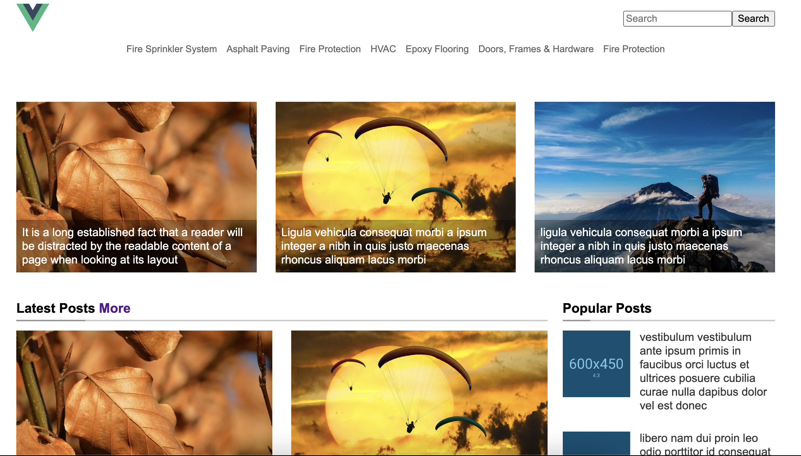
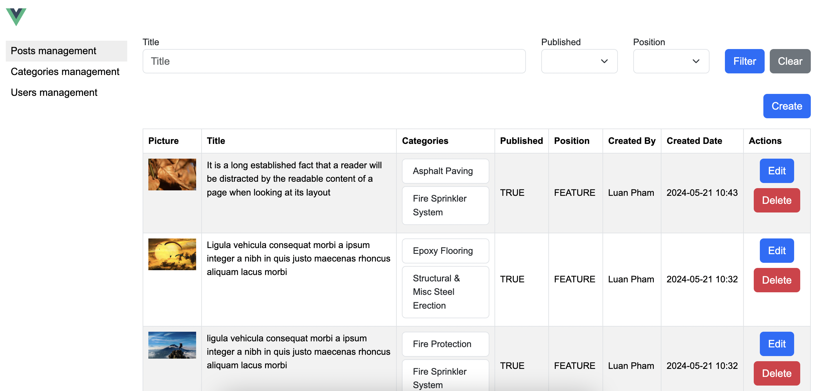

# ----------------- Description -----------------
This is a project content management. Manage the articles and users. It use kafka to stream data from mysql to elasticsearch and notification via socketIO. Store the image files in AWS S3 (localstack environment).

The project can lauch by docker and already include all configurations that need to execute.

Admin panel: admin.phpblog.private
login email: luan4637@gmail.com
login password: admin

login email: user@mail.com
login password: admin

# ----------------- Technical -----------------
## Backend:
PHP, Laravel, SocketIO, Redis, Elasticsearch,
RabbitMQ, Kafka, Debezium, AWS S3
## Database:
MySql
## Frontend:
HTML, CSS, SASS, VueJS

# ----------------- Docker compose install -----------------
## add host file
127.0.0.1 phpblog.private
127.0.0.1 admin.phpblog.private
127.0.0.1 host.docker.internal

## start server and run settings automatically
cd [ROOT]
docker compose up

## install client vuejs
### client side
cd [ROOT]/client/frontend
npm install
npm run build (OR: npm run watch)
### admin panel
cd [ROOT]/client/admin
npm install
npm run build (OR: npm run watch)

# ----------------- Kuberneters -----------------
## add host file
127.0.0.1 phpblog.private
127.0.0.1 vueblog.private
127.0.0.1 admin.vueblog.private

## add redis host
docker run -d --name redis-host --network minikube redis

## add memcached host
docker run -d --name memcached-host --network minikube memcached

## start minikube
minikube start --driver=docker --nodes=2 --insecure-registry=registry:5000
OR
minikube start --driver=docker --nodes=2 --insecure-registry=registry:5000 --mount --mount-string C://Users//Luan//kubevolume:/mnt/data

## register phpfpm image
docker build -t phpfpm:latest .
docker run -d --name registry --network minikube -p 5001:5000 registry:2.7
docker image tag phpfpm:latest registry:5001/phpfpm:latest
docker push registry:5001/phpfpm:latest

## start application
cd [ROOT]/kubernetes
kubectl apply -f mysql-statefull.yaml
kubectl apply -f web-depl.yaml
kubectl apply -f web-ingress.yaml
minikube tunnel

# admin login
login email: luan4637@gmail.com
login password: admin

# ----------------- Manual install -----------------
## create database
CREATE DATABASE phpblog_db CHARACTER SET utf8mb4 COLLATE utf8mb4_unicode_ci;
CREATE USER 'phpblog_user'@'localhost' IDENTIFIED BY 'phpblog_password';
GRANT ALL PRIVILEGES ON phpblog_db.* TO 'phpblog_user'@'localhost';
FLUSH PRIVILEGES;

## migrate database
php artisan migrate

## create user admin
php artisan db:seed

login email: luan4637@gmail.com
login password: admin

## start server
php artisan serve

# screenshoots

